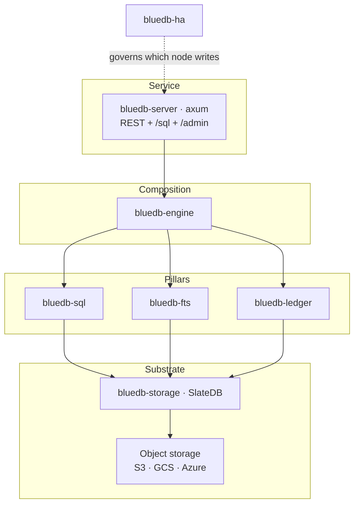
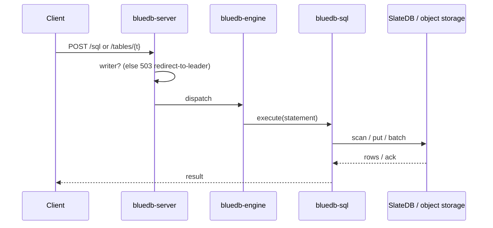

# Architecture

bluedb is a stack of focused layers over object storage. Each layer is a Rust
crate with a clear seam, so the pieces can be understood and tested
independently.

## Layers

| Layer | Crate | Responsibility |
|-------|-------|----------------|
| Service | `bluedb-server` | HTTP/REST, `/sql`, `/admin`, gates writes to the active writer |
| Composition | `bluedb-engine` | Wires REST→SQL and the FTS engine together |
| SQL | `bluedb-sql` | SQL over the substrate (see [SQL](../sql/README.md)) |
| Search | `bluedb-fts` | BM25 full-text search (tantivy) |
| Ledger | `bluedb-ledger` | Double-entry ledger *(in progress)* |
| Substrate | `bluedb-storage` | SlateDB LSM on object storage |
| HA | `bluedb-ha` | Lease election + self-fencing (see [HA](../ha/active-passive.md)) |

## The substrate

Everything persists in **one SlateDB keyspace** on object storage. SlateDB is an
LSM key-value store that writes SSTs and a WAL to a bucket — so durability and
scale are the object store's, and bluedb nodes hold no authoritative state on
local disk.

Keys are **tenant-namespaced** and **order-preserving**: schema, row, index, and
metadata records live in tag-separated namespaces, and row keys end in an
order-preserving encoding of the primary key. A byte-ordered range scan therefore
returns rows already in primary-key (or indexed-value) order — `ORDER BY <pk>`
needs no in-memory sort.

## Request path

Reads can be served by any node (replicas read the same object-storage
database). Writes are accepted only by the **active writer**; a replica returns
`503` so the client can re-discover the leader (see
[single-writer model](single-writer.md)).

## Design properties

- **Stateless nodes.** A node's authoritative state is in the object store; nodes
  can be added, killed, or replaced freely.
- **No DDL/migration tax.** Tables can be schemaless; schema is data, so adding
  fields needs no migration.
- **Portable.** The substrate targets any S3-compatible store, GCS, or Azure
  Blob.
