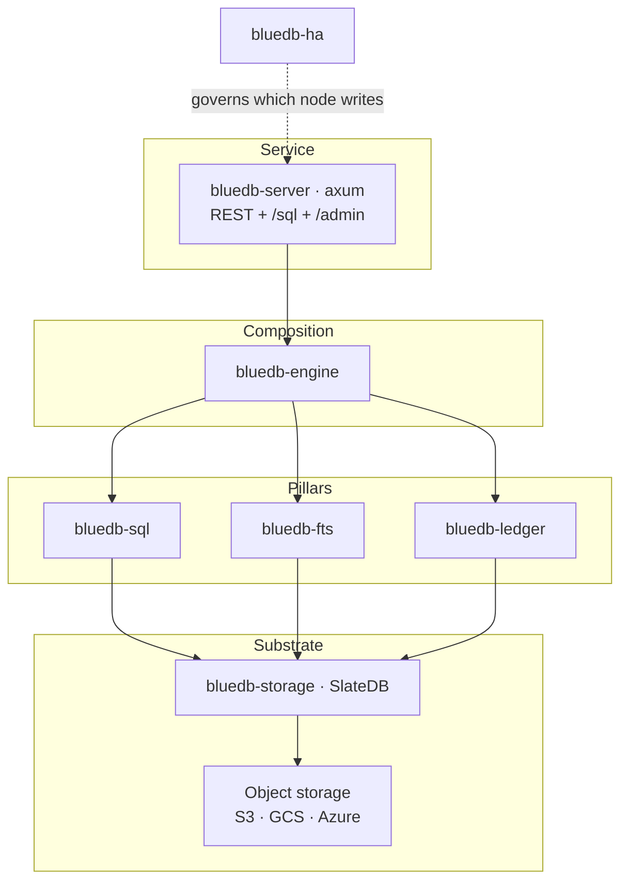
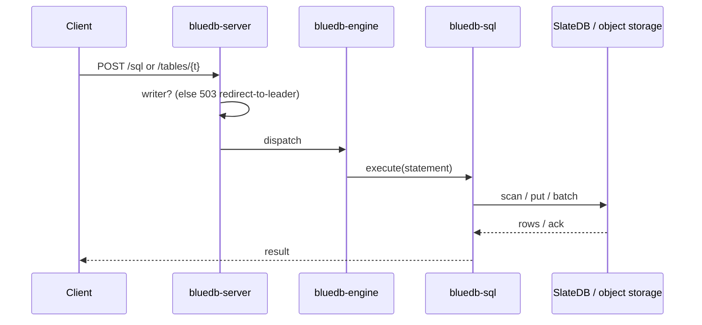

# Architecture

bluedb is a stack of focused layers over object storage. Each layer is a Rust
crate with a clear seam, so the pieces can be understood and tested
independently.

## Layers

| Layer | Crate | Responsibility |
|-------|-------|----------------|
| Service | `bluedb-server` | HTTP/REST, `/sql`, `/admin`, gates writes to the active writer |
| Composition | `bluedb-engine` | Wires REST→SQL and the FTS engine together |
| SQL | `bluedb-sql` | SQL over the substrate (see [SQL](../sql/README.md)) |
| Search | `bluedb-fts` | BM25 full-text search (tantivy) |
| Ledger | `bluedb-ledger` | Double-entry ledger *(in progress)* |
| Substrate | `bluedb-storage` | SlateDB LSM on object storage |
| HA | `bluedb-ha` | Lease election + self-fencing (see [HA](../ha/active-passive.md)) |

## The substrate

Everything persists in **one SlateDB keyspace** on object storage. SlateDB is an
LSM key-value store that writes SSTs and a WAL to a bucket — so durability and
scale are the object store's, and bluedb nodes hold no authoritative state on
local disk.

Keys are **tenant-namespaced** and **order-preserving**: schema, row, index, and
metadata records live in tag-separated namespaces, and row keys end in an
order-preserving encoding of the primary key. A byte-ordered range scan therefore
returns rows already in primary-key (or indexed-value) order — `ORDER BY <pk>`
needs no in-memory sort.

## Storage model: index-organized tables

Every bluedb table is **index-organized** — the rows *are* the primary-key
index. A row is stored at `…[TAG_DATA]<table-id><pk>` and the whole keyspace is
byte-sorted, so a table is physically one run clustered by its primary key. This
is the model Oracle calls an **IOT** (index-organized table) and what
InnoDB / SQL Server clustered indexes do. There is **no heap and no physical row
pointer** (Oracle `ROWID`, Postgres `ctid`):

- A primary-key point lookup is a direct key fetch; a PK **range / prefix /
  `ORDER BY pk`** is a contiguous byte range — no secondary structure, no sort.
  This is the fast [point/range access path](../sql/query-guardrail.md); other
  reads are served by an analytical scan.
- Secondary indexes map `indexed-value → primary key` (a *logical* pointer, not a
  physical address), so they ride the same clustered store.

This is the **natural** model for an LSM, not just a choice. A physical `ROWID`
only means something on a mutable block store, where a row has a stable home to
point at and an index→ROWID→heap hop is a real O(1) fetch. On an LSM rows are
immutable entries that are rewritten and relocated on every compaction — there is
no stable address — so the *key* is the address and clustering by it is free.

**Composite keys** keep the model: `PRIMARY KEY (a, b)` is encoded into a single
hidden surrogate (`__bluedb_pk`, an order-preserving concat of the components)
that becomes the clustering key, so `(a, b)` point/prefix/range/keyset lookups are
contiguous ranges too. See
[Composite primary keys](../sql/statements.md#composite-primary-keys).

The one cost of clustering by the key is that changing a key column **moves** the
row (delete-here + insert-there) instead of updating it in place — which is why
`UPDATE` of a primary-key column is rejected (delete and re-insert). A heap+rowid
design would make that cheap, but at the price of an index→rowid→row hop on every
read and lost key-clustering — a poor trade on an LSM, where the hop buys no
physical-fetch speedup.

**One clustering, two engines.** Because the operational store is already sorted
by the primary key, the [Iceberg mirror](../lakehouse/iceberg-mirror.md) seals to
**Parquet in that same order with no re-sort**: data files — and the row groups
inside them — come out clustered by the key, which gives tight per-column
min/max statistics and strong file / row-group **pruning** in the warehouse. The
OLTP clustering and the analytical (Parquet) clustering are the *same* ordering,
so there is no ETL sort step between the two.

## Request path

Reads can be served by any node (replicas read the same object-storage
database). Writes are accepted only by the **active writer**; a replica returns
`503` so the client can re-discover the leader (see
[single-writer model](single-writer.md)).

## Design properties

- **Stateless nodes.** A node's authoritative state is in the object store; nodes
  can be added, killed, or replaced freely.
- **Online schema evolution.** Every table is schema'd with a `PRIMARY KEY`, but
  evolving one is cheap: ADD/DROP/RENAME column and RENAME TABLE are O(1) metadata
  ops (stable field-ids + table-ids), never a row rewrite — no migration window.
  The same stable per-column id (the column-catalog *slot*) is what the
  [Iceberg mirror](../lakehouse/iceberg-mirror.md#schema-evolution) maps to an
  Iceberg field-id, so `ALTER` reconciles into the warehouse view without a
  rewrite there either.
- **Index-organized storage.** Every table is clustered by its primary key (no
  heap, no `ROWID`) — PK reads are contiguous range scans, and that same ordering
  seals to Parquet with no re-sort. See [Storage model](#storage-model-index-organized-tables).
- **Two read tiers, one SQL surface.** Point and range lookups by primary key or
  index are served from the row store; analytical reads (joins, aggregates,
  window functions, arbitrary filters/sorts) are served columnar from the
  [Iceberg mirror](../lakehouse/iceberg-mirror.md), off the OLTP hot path.
- **Portable.** The substrate targets any S3-compatible store, GCS, or Azure
  Blob — all three verified end-to-end with a real SlateDB round-trip (S3/Azure
  via emulators, GCS against real GCS). See
  [Configuration → Object store](../deployment/configuration.md#object-store).
