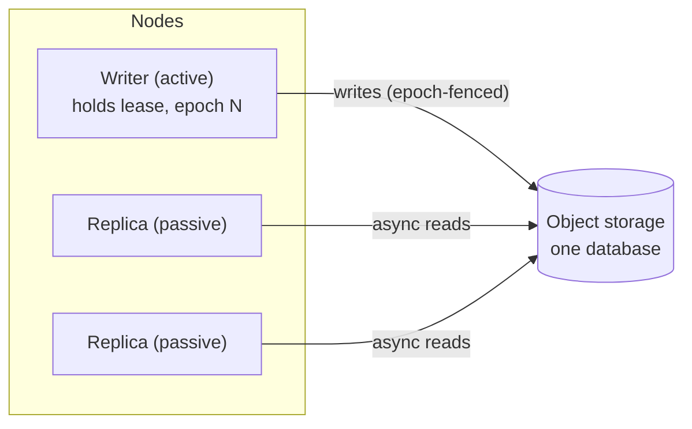

# The single-writer model

bluedb's substrate is **single-writer**: at any moment, exactly one node may
mutate a given database. This is the foundation of its consistency story, and
it's enforced at two levels.

## Two levels of enforcement

1. **Storage fencing (mechanism).** SlateDB stamps every durable write with a
   `writer_epoch` and uses a compare-and-set: a node whose epoch is stale cannot
   commit. Even if two nodes briefly believe they are the writer, only the one
   with the current epoch can durably write. There is no divergent history.

2. **Lease election (policy).** [`bluedb-ha`](../ha/active-passive.md) decides
   *which* node should be the writer using a time-bounded, epoch-stamped lease
   (backed by Postgres, a Kubernetes `Lease`, or NATS KV). The holder renews it;
   it **self-fences** (stops writing) within a safety margin of expiry, so it
   never writes into a window where another node could be promoted.

Mechanism + policy together give: **automatic failover with no split-brain and
no lost acknowledged writes**.

## Reads scale, writes serialize

- **Reads** are served by any node with no coordination: replicas read the same
  object-storage database. Add replicas to scale read throughput.
- **Writes** go through the one active writer. Concurrent autocommit writes are
  coalesced into one object-store flush (group commit) for throughput; an
  explicit `BEGIN … COMMIT` serializes its read-modify-write.

!!! note "Why single-writer?"
    A single serial writer makes correctness tractable on object storage: there
    is exactly one history to reason about, snapshot isolation falls out
    naturally, and failover is "promote a replica" rather than "merge divergent
    state." The cost is write throughput is one node's, which is acceptable for OLTP
    workloads, and the read path scales out independently.

## What clients see

A client sends writes to the active writer. If it hits a replica, it gets a
`503` and re-discovers the leader via `/admin/status`. During a failover the
writer identity moves to a promoted replica; a client that follows the leader
sees a brief unavailability window (roughly one lease TTL), then resumes with every
previously-acknowledged write intact.

See [Consistency & guarantees](../guarantees/consistency.md) and the
[Jepsen report](../guarantees/jepsen.md).
