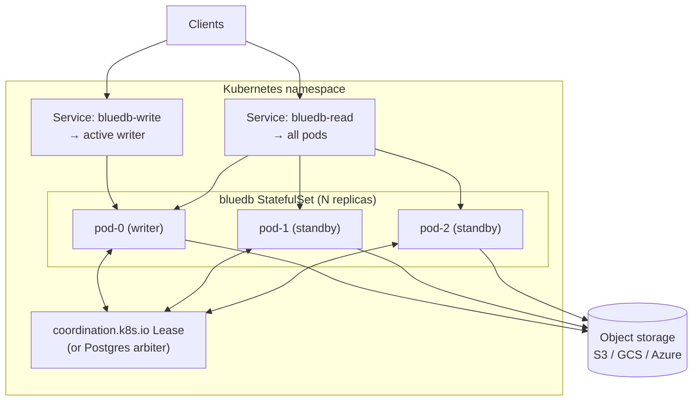

# Kubernetes

This is a deployment **guide** — the topology, the moving parts, and the key
settings. It uses illustrative snippets, not a committed manifest set or Helm
chart (those are on the roadmap).

!!! note
    bluedb nodes are stateless (state lives in the object store), so a node maps
    cleanly onto a Pod. The two things Kubernetes must provide are an
    **object-store backend** (managed S3/GCS/Azure, or in-cluster MinIO) and a
    **lease arbiter** for writer election.

## Topology



## Pieces

| Piece | Purpose |
|-------|---------|
| **StatefulSet** (or Deployment) | Runs N `bluedb-server` pods with stable identities (`BLUEDB_NODE_ID` = pod name) |
| **Lease arbiter** | A Kubernetes `coordination.k8s.io/Lease` (via the lease provider) *or* a Postgres `BLUEDB_LEASE_PG_URL` — elects one writer |
| **Object storage** | Managed bucket (recommended) or in-cluster MinIO |
| **Write Service** | Routes writes to the active writer; replicas return `503` so clients re-discover the leader |
| **Read Service** | Load-balances reads across all pods |
| **Readiness/liveness** | `GET /health`; readiness can gate the write Service on `is_active` via `/admin/status` |

## Configuration

Each pod is configured purely through environment variables — the same ones the
[Docker](docker.md) and [Compose](local.md) deployments use. A `ConfigMap` holds
the shared settings; the pod name supplies `BLUEDB_NODE_ID`. For example
(sketch):

```yaml
# ConfigMap (sketch) — shared node settings
BLUEDB_S3_BUCKET: bluedb
BLUEDB_S3_REGION: us-east-1
BLUEDB_DB_PATH: bluedb
BLUEDB_LEASE_PG_URL: postgresql://…           # or the K8s Lease provider
BLUEDB_LEASE_TTL_SECS: "15"
BLUEDB_LEASE_MARGIN_SECS: "5"
```

```yaml
# StatefulSet pod spec (sketch) — node identity + secrets
env:
  - name: BLUEDB_NODE_ID
    valueFrom: { fieldRef: { fieldPath: metadata.name } }
  - name: BLUEDB_S3_ACCESS_KEY_ID
    valueFrom: { secretKeyRef: { name: bluedb-s3, key: access-key-id } }
  - name: BLUEDB_S3_SECRET_ACCESS_KEY
    valueFrom: { secretKeyRef: { name: bluedb-s3, key: secret-access-key } }
readinessProbe:
  httpGet: { path: /health, port: 8080 }
```

See [Configuration](configuration.md) for every variable.

## Writer election: two options

- **Postgres arbiter** — set `BLUEDB_LEASE_PG_URL` to a Postgres reachable from
  all pods. Simplest if you already run Postgres; identical to the Compose setup.
- **Kubernetes `Lease`** — use the native `coordination.k8s.io/Lease` object via
  the lease provider (no extra datastore). Requires RBAC granting the pods
  `get`/`update` on a `Lease` resource.

Either way, `bluedb-ha` self-fences within `BLUEDB_LEASE_MARGIN_SECS` of expiry
and SlateDB's epoch CAS fences any straggler — see
[Active-passive HA](../ha/active-passive.md).

## Routing writes to the leader

The write `Service` must reach the active writer. Two common approaches:

1. **Readiness-gated** — a pod reports *ready* only while active (a sidecar/probe
   checks `/admin/status`), so the write `Service`'s endpoints contain only the
   writer. Reads use a separate always-ready `Service`.
2. **Client-follows-leader** — point clients at any pod; on a `503` they
   re-discover the writer via `/admin/status` (this is what the
   [Jepsen](../guarantees/jepsen.md) client does).

## Scaling

- **Reads** — increase replicas; the read `Service` spreads load. No
  coordination cost.
- **Writes** — fixed at one writer (the [single-writer model](../concepts/single-writer.md));
  scale writes by sharding across databases at the application layer.

## Multi-region

Run an independent cluster per region against per-region buckets, with
cross-region object-store replication and gated promotion — see
[Multi-region](../ha/multi-region.md).
