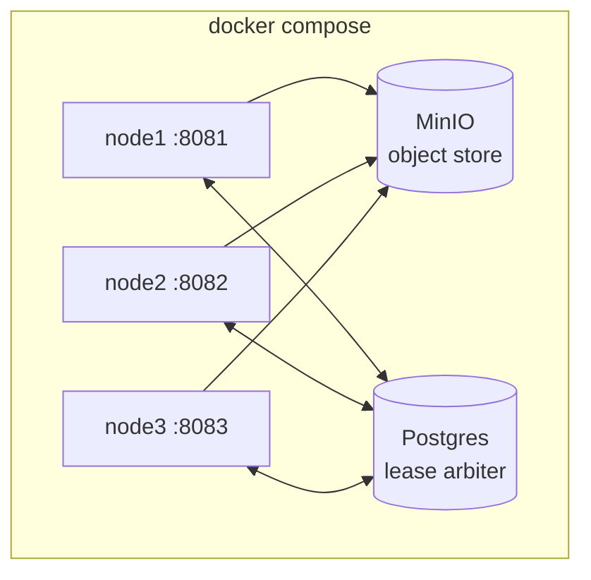

# Local deployment

The repository ships a Docker Compose stack that brings up a complete bluedb
cluster — object store, lease arbiter, and three nodes — for development,
failover testing, and [Jepsen](../guarantees/jepsen.md).

## What's in the stack



- **MinIO** — S3-compatible object store; the shared database lives here.
- **Postgres** — the lease arbiter that elects exactly one writer.
- **node1 / node2 / node3** — `bluedb-server` on host ports `8081` / `8082` /
  `8083` (container `8080`). One bootstraps as writer; the others follow as
  replicas.

## Start

```bash
docker compose up -d --build
curl -s localhost:8081/admin/status   # find the active writer
```

## Use

Writes go to the active writer; reads to any node. See the
[Quickstart](../quickstart.md) for SQL/REST examples and a failover demo.

## Tear down

```bash
docker compose down -v     # -v also removes the MinIO/Postgres volumes
```

## Single-node (no cluster)

For a quick single node without MinIO/Postgres, run `bluedb-server` directly with
a local filesystem object store and the in-process lease:

```bash
BLUEDB_DATA_DIR=./data BLUEDB_ADDR=0.0.0.0:8080 \
  cargo run -p bluedb-server
```

With no `BLUEDB_S3_*` and no `BLUEDB_LEASE_PG_URL`, the node uses a local-FS
object store and an in-process lease (it is the sole writer). See
[Configuration](configuration.md) for all options.
