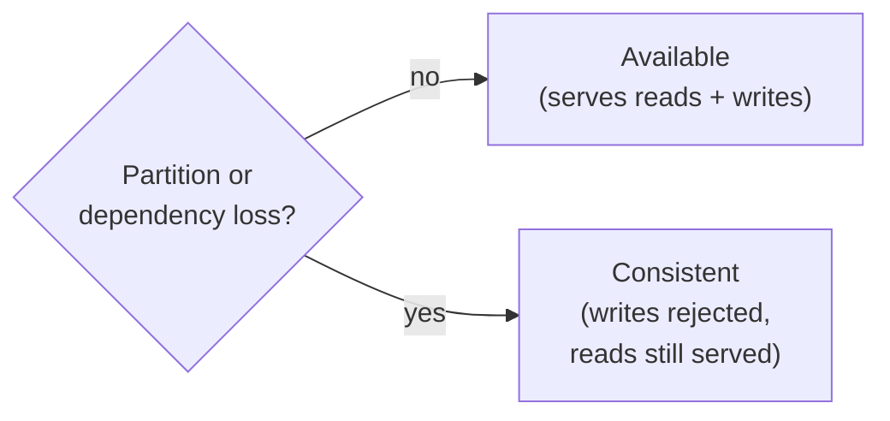

# Consistency model

bluedb is a **CP** system (consistent and partition-tolerant). When a dependency
fails or the cluster partitions, bluedb gives up *availability*, not
*consistency*: it will refuse writes rather than risk a split-brain or a lost
acknowledged write.

## What bluedb guarantees

- **Single serial writer.** Exactly one node mutates a database at a time,
  enforced by SlateDB's `writer_epoch` compare-and-set. There is always one
  history.
- **Durability of acknowledged writes.** Any write that returns success (HTTP
  200) survives node failure and failover — it is durable in the object store
  before it is acknowledged.
- **No lost updates.** A read-modify-write (e.g. `UPDATE c SET n = n + 1`) cannot
  silently clobber a concurrent one.
- **No fabricated or duplicated effects.** No row appears that was never written;
  a racing `INSERT` of the same primary key succeeds at most once.
- **Snapshot isolation** for transactional reads; explicit transactions are
  checked up to **strict-serializable** (see [Transactions &
  isolation](transactions.md)). [Evidence graph traversals](../evidence/graph.md#consistency)
  on the active writer are snapshot-isolated too — each pins one snapshot, so a
  traversal sees a single consistent cut of the graph even under concurrent
  edge rewrites.
- **No split-brain.** If the lease arbiter or object store is unreachable, the
  writer self-fences and standbys decline to promote — the cluster goes
  *writer-less* (rejects writes) rather than admit two writers.

These are not aspirational: each is exercised by the [Jepsen](jepsen.md) suite
under injected faults, with `:valid? true` / `lost-count 0`.

## CAP positioning

When Postgres (the lease arbiter) or the object store is down:

- The writer **keeps its lease validity but cannot durably write** (storage
  down) or **cannot renew and self-fences** (arbiter down).
- Standbys **cannot acquire** the lease, so no one promotes.
- The cluster becomes **writer-less** until the dependency recovers — and then
  resumes automatically. No acknowledged write is lost; no split-brain occurs.

Reads continue to be served throughout (from the last durable state).

## What bluedb does *not* guarantee

- **Multi-writer scaling.** Write throughput is one node's. Scale reads with
  replicas; scale writes by sharding across databases at the application layer.
- **Zero-downtime writes during failover.** There is a brief writer-less window
  (~lease TTL, default 10s) while a standby promotes.
- **Cross-region RPO 0.** Intra-region failover is RPO 0 (shared database);
  multi-region active-passive is RPO > 0 (see [Multi-region](../ha/multi-region.md)).

## Related

- [Transactions & isolation](transactions.md)
- [Jepsen report](jepsen.md)
- [Active-passive HA](../ha/active-passive.md)
