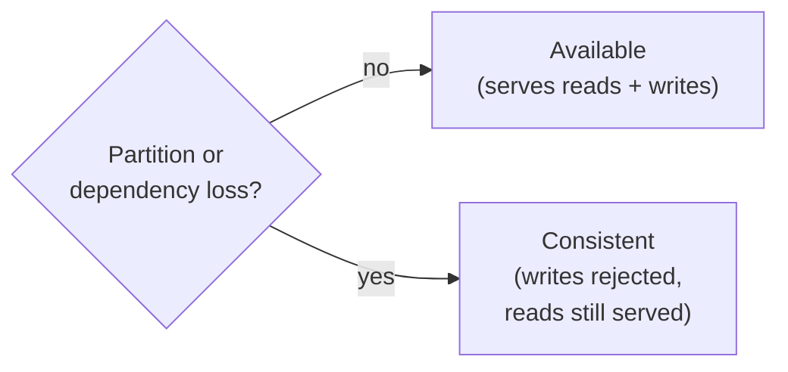

# Consistency model

bluedb is a **CP** system (consistent and partition-tolerant). When a dependency
fails or the cluster partitions, bluedb gives up *availability*, not
*consistency*: it will refuse writes rather than risk a split-brain or a lost
acknowledged write.

## What bluedb guarantees

- **Single serial writer.** Exactly one node mutates a database at a time,
  enforced by SlateDB's `writer_epoch` compare-and-set. There is always one
  history.
- **Durability of acknowledged writes.** Any write that returns success (HTTP
  200) survives node failure and failover — it is durable in the object store
  before it is acknowledged.
- **No lost updates.** A read-modify-write (e.g. `UPDATE c SET n = n + 1`) cannot
  silently clobber a concurrent one.
- **No fabricated or duplicated effects.** No row appears that was never written;
  a racing `INSERT` of the same primary key succeeds at most once.
- **Snapshot isolation** for transactional reads; explicit transactions are
  checked up to **strict-serializable** (see [Transactions &
  isolation](transactions.md)). [Evidence graph traversals](../evidence/graph.md#consistency)
  on the active writer are snapshot-isolated too — each pins one snapshot, so a
  traversal sees a single consistent cut of the graph even under concurrent
  edge rewrites.
- **No split-brain.** If the lease arbiter or object store is unreachable, the
  writer self-fences and standbys decline to promote — the cluster goes
  *writer-less* (rejects writes) rather than admit two writers.

These are not aspirational: each is exercised by the [Jepsen](jepsen.md) suite
under injected faults, with `:valid? true` / `lost-count 0`.

## Read consistency

Writes and their acknowledgement are linearizable (single serial writer, above).
Reads have a **two-tier** model, because every node shares one object-storage
database and a read can be served by the writer *or* a replica.

### Reads on the active writer — fresh (read-your-writes)

The active writer serves reads from its own live state (in-memory memtable + WAL
+ SSTs), so a read on the writer reflects **every write it has acknowledged**,
including writes not yet flushed to object storage. A client that routes a read
to the current active writer gets read-your-writes and a linearizable view.

This is why the mutating routes (`POST /sql`, `POST`/`PATCH`/`DELETE /tables`)
and their read-modify-writes run only on the active node: an `UPDATE c SET n = n
+ 1` is always evaluated against the writer's live state, never a replica's.

### Reads on a passive replica — bounded-stale

A passive node serves reads from a `DbReader` that **follows the writer's
manifest in object storage**, refreshed on a poll (SlateDB's
`manifest_poll_interval`, ~10 s by default). A replica therefore:

- never sees a write the writer has not yet **flushed** to object storage, and
- can lag even flushed writes by up to one poll interval.

This is **deliberate**: `GET /tables/{table}` is served by either the writer or
a replica, so replicas absorb read load. The trade is freshness — a replica read
is eventually-consistent, not linearizable.

### Routing across failover

The cluster presents as **one logical store routed through the current writer**:
clients find it via `GET /admin/status` (`role: "active"`) and re-discover after
a failover. Two properties keep that routing honest:

- **A node reports `active` only once its writer `Db` is installed** — not merely
  when it has acquired the lease. During the brief promote window a node holds
  the lease but is still bound to its *pre-failover replica* view, so it reports
  `passive` until the writer `Db` is swapped in. A client routing to "the active
  node" during or just after failover therefore reaches a node serving
  **writer-fresh** reads, never one still answering from a stale replica. (This
  closed a failover read-staleness bug the `counter` workload caught: a
  just-promoted node briefly advertised `active` while still serving its old
  replica view, so its reads looked like lost increments — see
  [Jepsen](jepsen.md).)
- **On an abrupt failover (crash / kill) the old writer is gone**, so a client's
  next read to it fails and the client re-resolves to the new writer.

!!! warning "Known caveat — stale reads under a *graceful* handoff"
    Because `GET /tables` reads are intentionally **not** writer-gated (replica
    reads are a feature), a client that caches a leader and keeps reading from a
    node that has since stepped down to `passive` can observe bounded-stale data
    (up to one manifest poll interval) until it re-resolves. This can never lose
    or corrupt data — it is purely a *freshness* bound on reads routed to a
    replica. For a strictly linearizable read, re-resolve the active writer for
    that read (or issue it on the `/sql` path, which runs on the writer). For
    read scaling, read any node and accept the bounded staleness.

## CAP positioning

When Postgres (the lease arbiter) or the object store is down:

- The writer **keeps its lease validity but cannot durably write** (storage
  down) or **cannot renew and self-fences** (arbiter down).
- Standbys **cannot acquire** the lease, so no one promotes.
- The cluster becomes **writer-less** until the dependency recovers — and then
  resumes automatically. No acknowledged write is lost; no split-brain occurs.

Reads continue to be served throughout (from the last durable state).

## What bluedb does *not* guarantee

- **Multi-writer scaling.** Write throughput is one node's. Scale reads with
  replicas; scale writes by sharding across databases at the application layer.
- **Linearizable reads from *replicas*.** A read served by a passive replica is
  eventually-consistent (bounded by the manifest poll interval, ~10 s). Route
  reads to the active writer — or use the `/sql` path — for read-your-writes /
  linearizable reads. See [Read consistency](#read-consistency).
- **Zero-downtime writes during failover.** There is a brief writer-less window
  (~lease TTL, default 10s) while a standby promotes.
- **Cross-region RPO 0.** Intra-region failover is RPO 0 (shared database);
  multi-region active-passive is RPO > 0 (see [Multi-region](../ha/multi-region.md)).

## Related

- [Transactions & isolation](transactions.md)
- [Jepsen report](jepsen.md)
- [Active-passive HA](../ha/active-passive.md)
