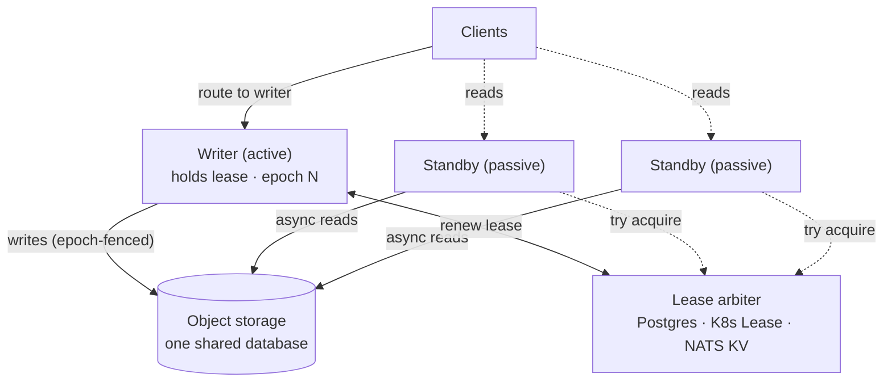
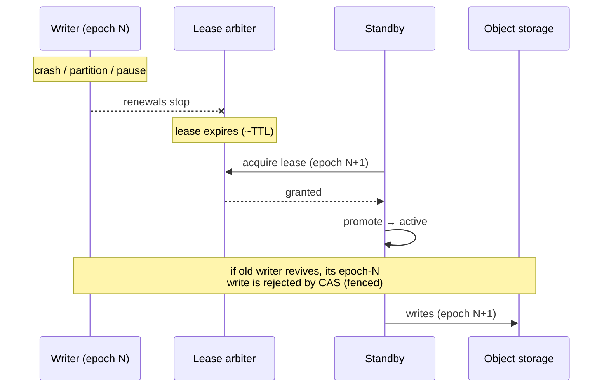
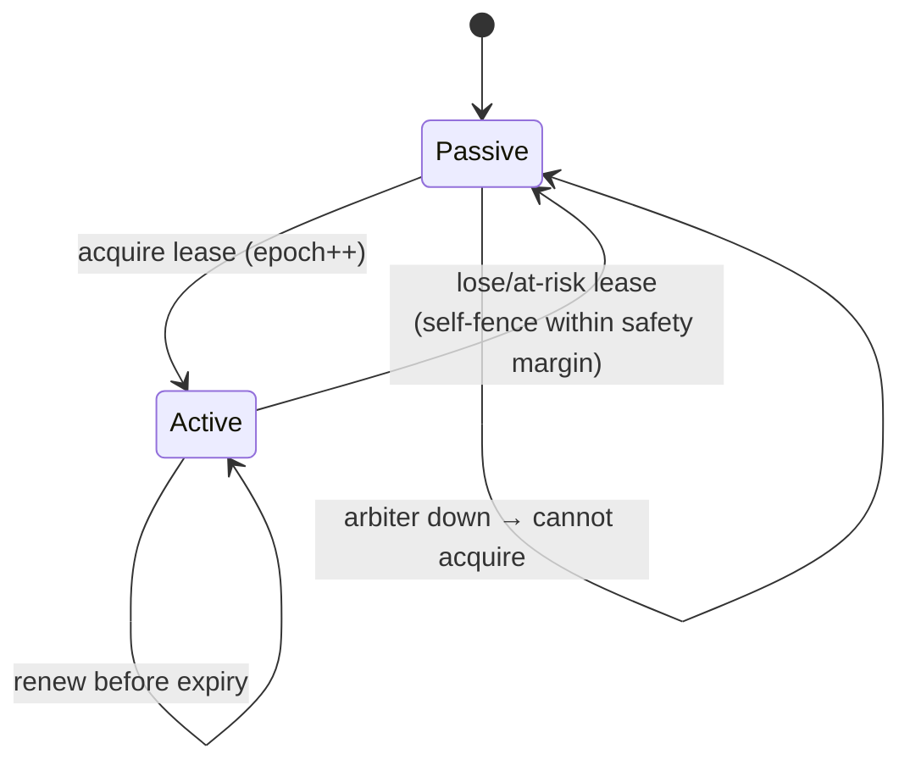

# Active-passive high availability

bluedb runs **active-passive**: one node is the active writer, the rest are
passive read replicas, and on writer loss a replica is **promoted
automatically** with no lost acknowledged writes and no split-brain.

Because all nodes share the **same object-storage database**, failover is
"promote a replica," not "merge divergent state." Intra-region failover is
**RPO 0**.

## Topology

## The two mechanisms

bluedb separates **policy** (who *should* write) from **mechanism** (who *can*
write):

1. **Lease election (policy)**: `bluedb-ha`'s `WriterController` holds a
   time-bounded, epoch-stamped lease from a pluggable `LeaseProvider`
   (Postgres / Kubernetes `Lease` / NATS KV). The holder renews it on a
   background loop and **self-fences** (stops accepting writes) within a
   `safety_margin` of expiry, so it can't write into a window where another node
   might promote.

2. **Storage fencing (mechanism)**: SlateDB stamps every durable write with a
   `writer_epoch` and uses a compare-and-set. A node with a stale epoch
   physically cannot commit. Even a brief two-writers belief produces no
   divergence: only the current epoch wins.

Policy decides quickly; mechanism is the backstop that makes mistakes safe.

!!! note "Two independent epochs"
    The lease `epoch` (policy) and SlateDB's `writer_epoch` (mechanism) are
    **separate monotonic counters**, not one value threaded through. The lease
    epoch advances in the arbiter on each genuine hand-off and fences *lease
    renewal*; SlateDB bumps its own `writer_epoch` from its persisted manifest
    every time a writer `Db` is opened and fences *durable writes*. They are not
    derived from each other. They compose only in that each independently admits
    at most one writer. (The failover diagram's `epoch N → N+1` is the lease
    epoch; SlateDB's storage epoch advances on its own whenever the new writer
    opens its `Db`.)

## Failover sequence

1. The writer fails (crash, partition, or pause) and stops renewing.
2. The lease **expires** after its TTL (default 10s).
3. A standby **acquires** the lease with a **higher epoch** (N+1) and promotes.
4. If the old writer revives, its epoch-N writes are **rejected by SlateDB's
   CAS**: it sees the bumped epoch and steps down. No split-brain.

The window between (1) and (3) is writer-less: writes are briefly rejected,
reads continue. No acknowledged write is lost.

## Writer lifecycle

A node only writes while `is_active`, and `is_active` goes false the moment the
lease is within `safety_margin` of expiry, *before* anyone else could take it.

!!! note "`active` means lease held **and** writer `Db` installed"
    Promotion acquires the lease *first*, then opens and swaps in the writer
    `Db`. A node reports `active` (and accepts writer-gated traffic) only after
    that swap. During the brief gap it still holds its pre-failover replica
    view, so it reports `passive`. This keeps `/admin/status` honest: a client
    routing to "the active node" never reaches one that holds the lease but is
    still serving a stale replica. See
    [Read consistency](../guarantees/consistency.md#routing-across-failover).

## Configuration

The lease behavior is tuned with a few settings (see
[Configuration](../deployment/configuration.md)):

| Setting | Default | Meaning |
|---------|---------|---------|
| `BLUEDB_LEASE_TTL_SECS` | 15 (10 in compose) | Lease lifetime; bounds failover time |
| `BLUEDB_LEASE_MARGIN_SECS` | 5 (3 in compose) | Self-fence this far before expiry |
| `BLUEDB_NODE_ID` | `node-0` | This node's identity in the lease |
| `BLUEDB_START_PASSIVE` | unset | Start as a replica and wait to be promoted |

## Verifying it

The [Jepsen](../guarantees/jepsen.md) `kill` / `partition` / `pause` / `skew`
nemeses exercise exactly this path and confirm `lost-count 0` across failover.
Try it yourself in the [Quickstart](../quickstart.md#4-try-a-failover).
