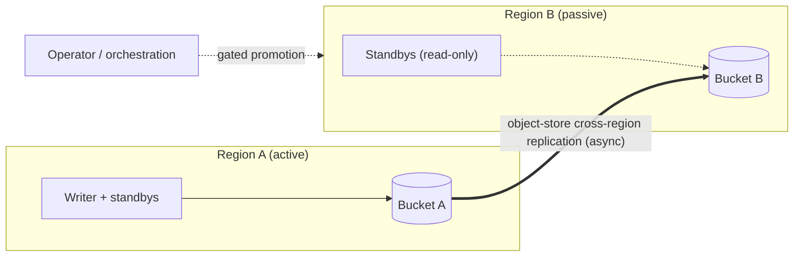

# Multi-region (active-passive)

Intra-region failover is [RPO 0](active-passive.md) because all nodes share one
object-storage database. **Across regions**, where each region has its own
object-storage bucket, bluedb runs **active-passive with RPO > 0**: a passive
region is kept warm by cross-region replication and promoted on a regional
outage.

## How it works

- **Replication.** Region A's bucket replicates to Region B's bucket using the
  object store's own **cross-region replication** (S3 CRR, GCS dual/multi-region,
  Azure GRS). This is asynchronous: Region B lags Region A by the replication
  delay, which is the **RPO**.
- **Passive region.** Region B's nodes run read-only against bucket B. They serve
  reads (lagging) and stand ready to take over.
- **Failover.** On a Region A outage, the operator (or orchestration) promotes
  Region B: it **waits out the old region's lease TTL** before accepting writes,
  to guarantee the old writer has self-fenced, then drives `bluedb-ha`'s
  `promote` against bucket B.

!!! warning "RPO > 0 across regions"
    Because cross-region replication is asynchronous, a regional failover can
    lose the most recent writes that hadn't yet replicated (bounded by the
    replication lag). This is the standard trade-off for active-passive DR; use
    intra-region HA for RPO 0 and multi-region for disaster recovery.

## Where this lives

The cross-region pieces (replication setup, the gated-promotion wait, and the
orchestration of a regional cutover) are a **deployment/ops concern**, not
engine code. They drive the same `bluedb-ha` `promote`/`demote` surface that
intra-region failover uses. `bluedb-ha` deliberately contains no cross-region
logic: it provides the safe primitive (epoch-fenced promotion), and the
deployment layer sequences it across regions.

## Choosing a posture

| Goal | Posture |
|------|---------|
| Survive a node/AZ failure with no data loss | **Intra-region HA** (RPO 0), see [Active-passive HA](active-passive.md) |
| Survive a whole-region outage | **Multi-region active-passive** (RPO > 0, this page) |
| Both | Intra-region HA in each region + cross-region replication |
