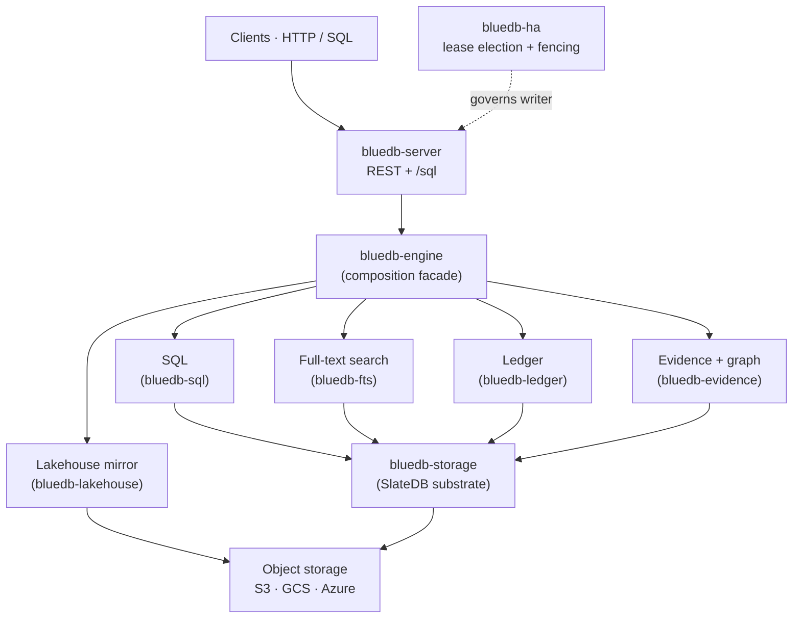

# bluedb

**bluedb is a database that runs on object storage.** SQL, full-text search, and
a double-entry ledger, all running straight on S3, GCS, or Azure Blob. There are
no local disks to provision and no storage cluster to operate. Schemas stay
explicit but evolve **online**: ADD/DROP/RENAME column and RENAME TABLE are O(1)
metadata ops, never a row rewrite.

One copy of your data feeds both halves of the workload, which makes bluedb
**HTAP**. Transactional point, range, and indexed reads come back fresh from the
LSM store. The analytical queries (joins, aggregates, window functions,
[JSON](sql/json.md)) run over a continuously seconds-fresh
[Apache Iceberg mirror](lakehouse/iceberg-mirror.md), through the same SQL
surface. No ETL, and no second system to keep in sync.

Under a partition, bluedb chooses consistency. It is **CP**, built on a single
serial writer plus asynchronous read replicas, with automatic failover. A real
[Jepsen](guarantees/jepsen.md) test suite backs the consistency claims.

## Why it exists

Object storage is the cheapest, most durable, most operationally boring storage
there is. It just isn't a database. bluedb makes it one: it puts an LSM engine
([SlateDB]) on the bucket, then layers SQL, search, and a ledger on top. You get
a database whose storage scales and survives like S3, and whose nodes stay
stateless and disposable.

[SlateDB]: https://slatedb.io

## The pillars

- **`bluedb-storage`**: the SlateDB substrate on object storage, with
  tenant-namespaced, order-preserving keys.
- **[`bluedb-sql`](sql/README.md)**: a SQL engine over the substrate. Schema'd
  tables with a `PRIMARY KEY`, online schema evolution, secondary indexes,
  transactions, views, [JSON columns and operators](sql/json.md), and a full
  `SELECT` surface (joins, aggregates, window functions, arbitrary filters and
  sorts), with the primary key and [indexes](sql/query-guardrail.md)
  accelerating point and range lookups.
- **[`bluedb-fts`](sql/full-text-search.md)**: **SQL-integrated** BM25 full-text
  search (tantivy) over object storage. Declare a full-text index and query it
  through SQL (Postgres `@@`/`ts_rank`), with read-your-writes and no separate
  search cluster.
- **[`bluedb-ledger`](api/ledger.md)**: a TigerBeetle-style double-entry ledger.
  Typed accounts and transfers, two-phase transfers, balances queryable over SQL.
- **[`bluedb-lakehouse`](lakehouse/iceberg-mirror.md)**: continuously mirrors
  tables to **Apache Iceberg** in the same bucket (full CRUD, seconds-fresh,
  exactly-once), so warehouses (BigQuery/Databricks/Snowflake) join bluedb data
  with **no ETL**. Served through a read-only Iceberg REST catalog.
- **[`bluedb-evidence`](evidence/chains.md)**: append-only, **verifiable
  evidence chains** (server-assigned dense sequencing, RFC 6962 Merkle
  inclusion/consistency proofs, GDPR-grade redaction), plus a **native graph
  store** with weighted-edge adjacency and **snapshot-isolated** traversal
  (`reachable`, `widest_path`).
- **[Collections](collections/README.md)**: a MongoDB-style document API over
  HTTP/JSON. Schema-free collections, MQL `find`/`aggregate`, and secondary,
  compound, and TTL indexes, with no MongoDB driver required.
- **[Collections search](collections/search.md)**: an Elasticsearch-shaped search
  surface over collections documents. BM25 relevance, the ES query DSL
  (`match`/`term`/`range`/`bool`/`exists`), and the ES hits-envelope response,
  with no ES client or Kibana required.
- **`bluedb-engine`**: composes the pillars behind one facade.
- **`bluedb-server`**: the HTTP/REST service (axum). CRUD, `/sql`, and admin.
- **[`bluedb-ha`](ha/active-passive.md)**: single-writer high availability.
  Lease election, self-fencing, automatic failover.

## Performance

bluedb acks a write only once it's **durable** (`await_durable`), so write latency
tracks the WAL flush interval (`BLUEDB_FLUSH_INTERVAL_MS`, default 25 ms).
Throughput then **scales with the number of in-flight write clients**, because the
lone writer's WAL group-commits every concurrent insert into a single flush.
bluedb stays **single-writer**: the rows below are *N concurrent client
connections*, each issuing back-to-back single-row autocommit `INSERT`s against
the one writer node, not N writers. Measured on one node:

| Concurrent clients | Inserts/sec | p50 | p99 |
|--:|--:|--:|--:|
| 1 | 37 | 27 ms | 29 ms |
| 8 | 300 | 27 ms | 28 ms |
| 32 | 1,200 | 27 ms | 29 ms |
| 128 | 4,800 | 27 ms | 30 ms |
| 256 | 9,600 | 27 ms | 31 ms |

Latency stays flat at about the flush interval regardless of load, and throughput
rises roughly linearly with concurrency. A bulk load wrapped in one
`BEGIN…COMMIT` commits as a single `WriteBatch`: thousands of rows in one durable
write. Writes survive kill and partition with **zero acked-write loss**
([Jepsen](guarantees/jepsen.md)). See **[Sizing & capacity](operations/sizing.md)**
to turn this into a node count: how many concurrent clients a node sustains, and
the writes/sec that implies.

*Method and caveat:* single node, local-disk (SSD) backend, `flush_interval=25 ms`,
strong durability. Read these as a local engine upper bound, not a customer sizing
number. The current Civo UAT baseline through the public API and object-store
backend is roughly linear to **~128 concurrent write clients**, with the last
good run reaching **~400 writes/sec** at 256 clients and p99 around **1.5 s**;
use **~350 writes/sec** at 128 clients for the current sub-second p99 sizing
point. An Iceberg-mirror-on sanity sweep in one tenant landed in the same range
but saturated CPU at high concurrency. See
**[Sizing & capacity](operations/sizing.md#current-civo-write-slo)** before using
these numbers for deployment sizing. Reproduce the local lab benchmark with
`cargo test --release -p bluedb-sql --test throughput_bench -- --ignored`.

## Start here

- **[Quickstart](quickstart.md)**: run a local cluster and your first query.
- **[SQL reference](sql/README.md)**: the dialect bluedb accepts.
- **[Guarantees](guarantees/consistency.md)**: the consistency model and what Jepsen proves.
- **[High availability](ha/active-passive.md)**: active-passive failover, with diagrams.
- **[Deployment](deployment/local.md)**: local, Docker, and Kubernetes.
