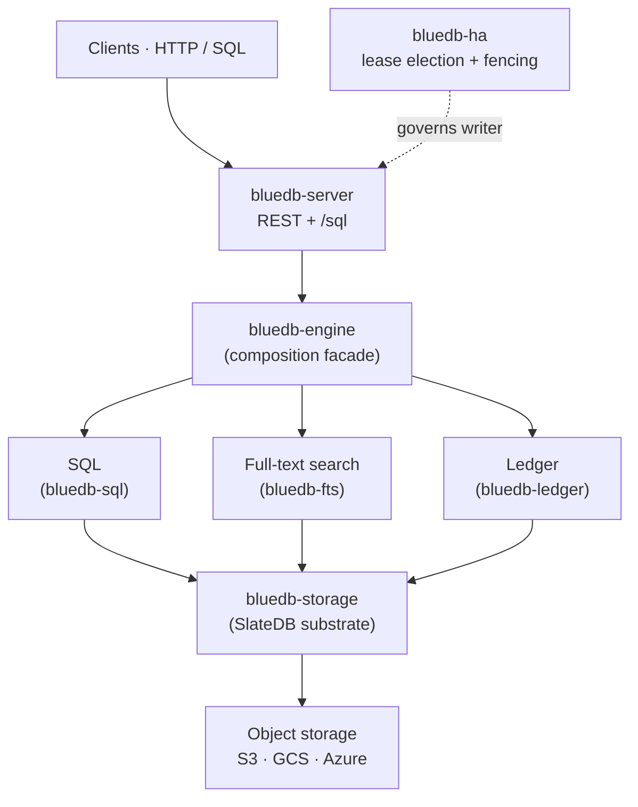

# bluedb

**bluedb is an object-storage-native database.** It runs SQL, full-text search,
and a double-entry ledger directly on object storage (S3, GCS, Azure Blob) — no
local disks to provision, no storage cluster to operate, and no DDL/migration
tax for schema changes.

It is **CP** (consistent under partition), built on a **single serial writer
plus asynchronous read replicas**, with automatic failover and a real
[Jepsen](guarantees/jepsen.md) test suite backing the consistency claims.

## Why it exists

Object storage is the cheapest, most durable, most operationally boring storage
there is — but it isn't a database. bluedb makes it one: it puts an LSM engine
([SlateDB]) on the bucket, then layers SQL, search, and a ledger on top. You get
a database whose storage scales and survives like S3, and whose nodes are
stateless and disposable.

[SlateDB]: https://slatedb.io

## The pillars

- **`bluedb-storage`** — the substrate: SlateDB on object storage, with
  tenant-namespaced, order-preserving keys.
- **[`bluedb-sql`](sql/README.md)** — a SQL engine (GlueSQL + a compatibility
  layer) over the substrate: typed *and* schemaless tables, transactions,
  secondary indexes, views.
- **[`bluedb-fts`](sql/full-text-search.md)** — **SQL-integrated** BM25 full-text
  search (tantivy) over object storage: declare a full-text index and query it
  through SQL (Postgres `@@`/`ts_rank`), read-your-writes, no separate search
  cluster.
- **[`bluedb-ledger`](api/ledger.md)** — a TigerBeetle-style double-entry ledger:
  typed accounts/transfers, two-phase transfers, balances queryable over SQL.
- **`bluedb-engine`** — composes the pillars behind one facade.
- **`bluedb-server`** — the HTTP/REST service (axum): CRUD, `/sql`, admin.
- **[`bluedb-ha`](ha/active-passive.md)** — single-writer high availability:
  lease election, self-fencing, automatic failover.

## Start here

- **[Quickstart](quickstart.md)** — run a local cluster and your first query.
- **[SQL reference](sql/README.md)** — the dialect bluedb accepts.
- **[Guarantees](guarantees/consistency.md)** — the consistency model and what Jepsen proves.
- **[High availability](ha/active-passive.md)** — active-passive failover, with diagrams.
- **[Deployment](deployment/local.md)** — local, Docker, and Kubernetes.
