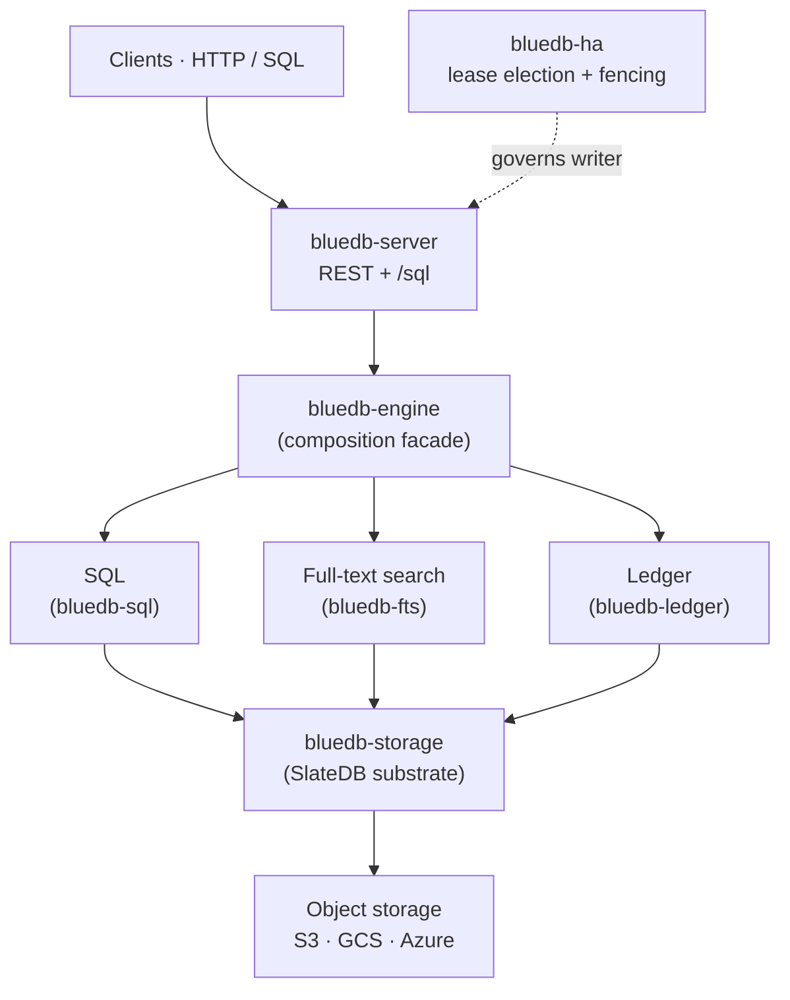

# bluedb

**bluedb is an object-storage-native database.** It runs SQL, full-text search,
and a double-entry ledger directly on object storage (S3, GCS, Azure Blob) — no
local disks to provision and no storage cluster to operate. Schemas are explicit
and evolve **online**: ADD/DROP/RENAME column and RENAME TABLE are O(1) metadata
ops, never a row rewrite.

It is **CP** (consistent under partition), built on a **single serial writer
plus asynchronous read replicas**, with automatic failover and a real
[Jepsen](guarantees/jepsen.md) test suite backing the consistency claims.

## Why it exists

Object storage is the cheapest, most durable, most operationally boring storage
there is — but it isn't a database. bluedb makes it one: it puts an LSM engine
([SlateDB]) on the bucket, then layers SQL, search, and a ledger on top. You get
a database whose storage scales and survives like S3, and whose nodes are
stateless and disposable.

[SlateDB]: https://slatedb.io

## The pillars

- **`bluedb-storage`** — the substrate: SlateDB on object storage, with
  tenant-namespaced, order-preserving keys.
- **[`bluedb-sql`](sql/README.md)** — a SQL engine (GlueSQL + a compatibility
  layer) over the substrate: schema'd tables with a `PRIMARY KEY`, online schema
  evolution, secondary indexes, transactions, views — and a plan-time
  [query guardrail](sql/query-guardrail.md) that keeps every read index-served.
- **[`bluedb-fts`](sql/full-text-search.md)** — **SQL-integrated** BM25 full-text
  search (tantivy) over object storage: declare a full-text index and query it
  through SQL (Postgres `@@`/`ts_rank`), read-your-writes, no separate search
  cluster.
- **[`bluedb-ledger`](api/ledger.md)** — a TigerBeetle-style double-entry ledger:
  typed accounts/transfers, two-phase transfers, balances queryable over SQL.
- **`bluedb-engine`** — composes the pillars behind one facade.
- **`bluedb-server`** — the HTTP/REST service (axum): CRUD, `/sql`, admin.
- **[`bluedb-ha`](ha/active-passive.md)** — single-writer high availability:
  lease election, self-fencing, automatic failover.

## Performance

bluedb acks a write only once it's **durable** (`await_durable`), so write latency
tracks the WAL flush interval (`BLUEDB_FLUSH_INTERVAL_MS`, default 25 ms) — and
throughput **scales with the number of in-flight write clients**, because the lone
writer's WAL group-commits every concurrent insert into a single flush. bluedb
stays **single-writer**: the rows below are *N concurrent client connections*, each
issuing back-to-back single-row autocommit `INSERT`s against the one writer node —
not N writers. Measured on one node:

| Concurrent clients | Inserts/sec | p50 | p99 |
|--:|--:|--:|--:|
| 1 | 37 | 27 ms | 29 ms |
| 8 | 300 | 27 ms | 28 ms |
| 32 | 1,200 | 27 ms | 29 ms |
| 128 | 4,800 | 27 ms | 30 ms |
| 256 | 9,600 | 27 ms | 31 ms |

Latency stays flat at ≈ the flush interval regardless of load; throughput rises
~linearly with concurrency. A bulk load wrapped in one `BEGIN…COMMIT` commits as a
single `WriteBatch` — thousands of rows in one durable write. Writes survive
kill/partition with **zero acked-write loss** ([Jepsen](guarantees/jepsen.md)). See
**[Sizing & capacity](operations/sizing.md)** to turn this into a node count — how
many concurrent clients a node sustains, and the writes/sec that implies.

*Method & caveat:* single node, local-disk (SSD) backend, `flush_interval=25 ms`,
strong durability. Networked object storage (S3/GCS/Azure) adds its PUT latency on
top of each flush, so read these as a local upper bound — a full object-store +
multi-node characterization is in progress. Reproduce with
`cargo test --release -p bluedb-sql --test throughput_bench -- --ignored`.

## Start here

- **[Quickstart](quickstart.md)** — run a local cluster and your first query.
- **[SQL reference](sql/README.md)** — the dialect bluedb accepts.
- **[Guarantees](guarantees/consistency.md)** — the consistency model and what Jepsen proves.
- **[High availability](ha/active-passive.md)** — active-passive failover, with diagrams.
- **[Deployment](deployment/local.md)** — local, Docker, and Kubernetes.
