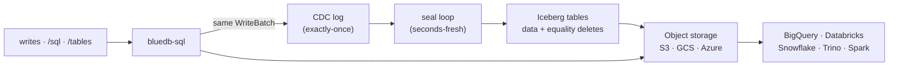

# Lakehouse mirror (Apache Iceberg)

bluedb continuously mirrors your tables into **Apache Iceberg** tables in the
same object storage it already runs on — so you can **join bluedb data with your
warehouse** (BigQuery, Databricks, Snowflake, Trino, Spark, DuckDB) without any
ETL, export job, or connector. The warehouse reads the Iceberg tables straight
from the bucket; the join runs *inside* the warehouse.

There is **no separate process and no build flag**: the mirror is always compiled
into `bluedb-server` and controlled entirely at runtime with a PRAGMA. It is
**off by default** — you opt in.



## Why mirror instead of federate?

bluedb stores data in SlateDB's LSM format, which a warehouse can't read, and
its SQL engine can't reach into a warehouse. Mirroring to Iceberg — the open
table format every major engine reads — makes bluedb tables first-class in your
lakehouse while keeping bluedb itself fast and operational. The Iceberg files
live **in the same bucket** as the SlateDB data, so there's one storage system to
manage and pay for.

## How it works

- **Change capture is exactly-once.** Every committed change on a mirror-enabled
  table is written as a CDC entry into the *same* atomic SlateDB `WriteBatch` as
  the row itself — so a change is captured if and only if it committed. No
  triggers, no polling the table.
- **Full CRUD via merge-on-read.** The seal loop drains the CDC log, collapses it
  last-writer-wins per primary key, and publishes one Iceberg snapshot per table:
  new/updated rows as data files, deletes (and the previous version of an
  updated row) as **equality-delete files** keyed on the primary key. Readers see
  the correct current state.
- **Seconds-fresh, skips idle tables.** Sealing is **event-driven**: a commit
  wakes the seal loop, which coalesces a short burst (debounce) and then writes a
  snapshot. An idle table never produces a snapshot.
- **Self-hosted catalog, no forks.** bluedb authors the Iceberg metadata
  (manifests → manifest list → snapshot → `metadata.json`) itself and publishes
  it through its own catalog pointer. It runs on the published `apache/iceberg-rust`
  with no fork, no patch, and no `unsafe`.
- **Sorted for free — one clustering, two engines.** bluedb tables are
  [index-organized](../concepts/architecture.md#storage-model-index-organized-tables):
  rows are stored clustered by the primary key. The seal collapses changes into
  that same key order, so each Parquet data file (and its row groups) comes out
  **sorted by the key with no re-sort step** — yielding tight per-column min/max
  statistics and strong file/row-group **pruning** in the warehouse. The
  operational and analytical clusterings are the same ordering. The mirror also
  declares a matching Iceberg **sort order** (on the key columns) so engines know.
- **Compaction is memory-bounded.** A background worker rewrites a table's
  small files into larger ones with deletes applied, streaming so peak memory is
  ≈ one output file regardless of table size.

A **primary key is required** on every mirrored table (it keys the merge-on-read
deletes) — which bluedb's [schema regime](../sql/query-guardrail.md) already
guarantees. **Composite primary keys** (`PRIMARY KEY (a, b)`) are mirrored too:
internally they are backed by a single hidden surrogate (`__bluedb_pk`, a `BYTEA`
of the order-preserving component encoding) that keys the merge-on-read deletes.
The component columns `a`, `b`, … are mirrored as ordinary, warehouse-visible
columns — join and filter on them directly. Because each seal writes rows in
surrogate (= tuple) order, the data files cluster by `(a, b)` and carry column
statistics, and the mirror declares an Iceberg **sort order** on the component
columns — so warehouses can prune files on them. (A single-column-PK table is
sorted by its primary key.)

## Enabling the mirror

The mirror is controlled by `PRAGMA lakehouse_mirror` over
[`POST /sql`](../api/rest.md#post-sql-run-one-parameterized-statement). It is
**off by default** (opt-in).

Mirror **one** table:

```sql
PRAGMA lakehouse_mirror_table('orders', on);
```

Or flip the **default** so every table is mirrored unless excluded (opt-out):

```sql
PRAGMA lakehouse_mirror = on;                  -- mirror everything
PRAGMA lakehouse_mirror_table('secrets', off); -- ...except this one
```

Enabling a table **backfills** its existing rows into Iceberg as the first
snapshot, then keeps it current from the CDC log. The setting is **durable** —
it is restored automatically on restart and failover. Mirroring runs only on the
active writer; a standby mirrors nothing and resumes on promotion.

## Reading from a warehouse

bluedb serves a read-only **Iceberg REST Catalog** at `/catalog/v1/*`, so engines
can discover and load the mirrored tables with the standard protocol:

```bash
# List mirrored tables
curl -s localhost:8081/catalog/v1/namespaces/default/tables

# Load one table (returns its current metadata location + schema)
curl -s localhost:8081/catalog/v1/namespaces/default/tables/orders
```

Point your warehouse's Iceberg REST catalog integration at
`http://<bluedb-host>:<port>/catalog` and give it read access to the bucket. Use
the namespace for the tenant you want (`default` for the default tenant — see
[Multi-tenancy](#multi-tenancy)). Catalog routes require a `data:read` token when
[authorization](../operations/admin.md) is enabled, and a token only sees the
namespaces for the tenants it is bound to.

The mirror is **read-only from the warehouse side**: writes always go through
bluedb's SQL/REST surface and flow to Iceberg automatically. Don't write to the
Iceberg tables directly.

## Multi-tenancy

bluedb is **multi-tenant**: every request is scoped to a tenant via the
`X-Bluedb-Tenant` header (absent ⇒ the default tenant `_`). Each tenant has its
own isolated keyspace, its own CDC log, and — in the mirror — its own **Iceberg
namespace** (`namespace == tenant`; the default tenant maps to `default`). Two
tenants can mirror identically-named tables with zero overlap.

```bash
# Mirror + write under tenant "acme"
curl -s localhost:8081/sql -H 'X-Bluedb-Tenant: acme' \
  -d '{"sql":"PRAGMA lakehouse_mirror = on"}'
curl -s localhost:8081/sql -H 'X-Bluedb-Tenant: acme' \
  -d '{"sql":"INSERT INTO orders VALUES (1, 99)"}'

# acme's tables live under the "acme" Iceberg namespace
curl -s localhost:8081/catalog/v1/namespaces/acme/tables
```

`PRAGMA lakehouse_mirror` is **per tenant** — enabling it for `acme` doesn't
affect any other tenant. The mirror set for each tenant is restored on
promote/failover from a durable tenant index, so no PRAGMA replay is needed.

When [authorization](../operations/admin.md) is enabled, bind a token to one or
more tenants with a `tenant:<name>` scope; the token can then act only on those
tenants (a `superuser` token reaches any). A token with no `tenant:` binding may
reach only the default tenant — so existing single-tenant token configs keep
working unchanged. See [Configuration](../deployment/configuration.md#api-surface--authorization).

### Cross-engine compatibility

The tables are written through the published `apache/iceberg-rust` and verified
**by an independent engine, not our own writer**: the test suite has DuckDB's
Iceberg extension read a self-authored table — including the equality-delete
merge-on-read result — and read a table *through the REST catalog* end-to-end.
Because the metadata is standard Iceberg v2 with fully-qualified storage URIs,
any Iceberg-v2 reader (Spark, Trino, Snowflake, BigQuery, Databricks, DuckDB)
should read it. Run the cross-engine checks (needs `python3` + the DuckDB
iceberg extension):

```bash
cargo test -p bluedb-lakehouse --test duckdb_compat -- --ignored      # data files
cargo test -p bluedb-server   --test catalog_compat -- --ignored      # REST catalog
```

## Type mapping

gluesql column types map to Iceberg types (see the
[design spec](https://github.com/bluecopa/bluedb) for the full table):

| bluedb / gluesql | Iceberg |
|---|---|
| `BOOLEAN` | `boolean` |
| `INT8/16/32`, `UINT8/16` | `int` |
| `INTEGER` (i64), `UINT32` | `long` |
| `UINT64` | `decimal(20,0)` |
| `INT128`/`UINT128` | `decimal(38,0)` |
| `FLOAT32` | `float` |
| `FLOAT` | `double` |
| `TEXT` | `string` |
| `BYTEA` | `binary` |
| `DATE` / `TIME` / `TIMESTAMP` | `date` / `time` / `timestamp` |
| `UUID` | `uuid` |
| `DECIMAL` | `decimal(38,18)` |
| `LIST` / `MAP` | native Iceberg `list` / `map` (element/value type inferred) |

## Configuration

All optional; sensible defaults shown.

| Env var | Default | Meaning |
|---|---|---|
| `BLUEDB_LAKEHOUSE_ROOT` | `lakehouse` | object-store key prefix for the Iceberg tables |
| `BLUEDB_LAKEHOUSE_SEAL_DEBOUNCE_MS` | `2000` | coalesce a burst of commits this long before sealing |
| `BLUEDB_LAKEHOUSE_SEAL_MAX_INTERVAL_MS` | `10000` | cap on how long a steady write stream delays a seal |
| `BLUEDB_LAKEHOUSE_COMPACTION_INTERVAL_MS` | `60000` | how often the compaction worker runs |
| `BLUEDB_LAKEHOUSE_MAX_DATA_FILES` | `8` | compact a table once it exceeds this many data files |

## Limitations (v1)

- **Schema evolution on a mirrored table** (ADD/DROP/RENAME column) is not yet
  reconciled into Iceberg — the mirror keeps the schema the table had at first
  seal. Field-id reconciliation (emitting an Iceberg schema update before the
  data snapshot) is the planned follow-up; until then, avoid `ALTER` on a
  mirrored table.
- **Compaction rewrites the whole table** per run (correct and memory-bounded);
  incremental bin-packed compaction is a planned optimization.
